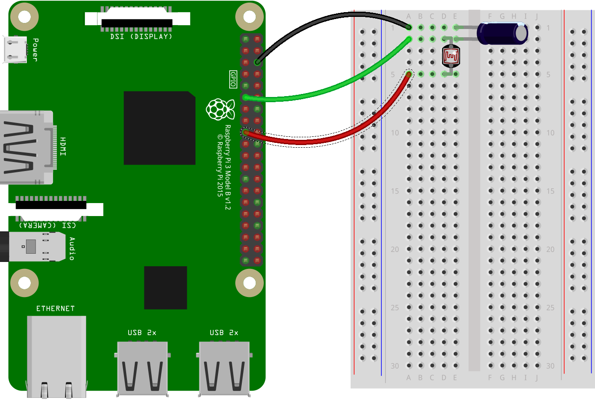

In this resource, you will learn how to build a circuit using a **l**ight-**d**ependent **r**esistor (LDR, or photoresistor) and write a script on the Raspberry Pi to detect light.


The resistance of an LDR changes depending on the amount of light that is falling on it. The more light hits the LDR, the lower is its resistance. If you're interested in the physics of how this works, you can have a look at [this resource](generic-rc-charging-circuit).

The Raspberry Pi's [GPIO](rpi-gpio-pins) pins can be used with a variety of electronic components. Some components are [analogue, while others are digital](generic-analogue-digital). Digital components are very easy to use with a Pi, because the Pi's GPIO pins are only capable of being on or off, and in turn detecting whether another device is on or off. To use analogue components, for example LDRs, you need to do a little more work.

### Setting up the circuit

You are going to set up a **r**esistor-**c**apacitor circuit (RC circuit) using a 1µF capacitor and an LDR. The two components will need to be in series with each other. One leg of the LDR will be attached to a 3.3V pin (labeled **3V3**) of the Raspberry Pi. The negative leg of the capacitor will be attached to a ground pin (labeled **GND**). The positive leg of the capacitor will be connected to any of the standard GPIO pins on the Raspberry Pi. Here is one possible configuration of the circuit.



### The script on the Raspberry Pi

The code for the light sensor is fairly simple. It will provide you with a relative value of the light in the environment as a floating-point number between 0 and 1. The higher the value, the more light is falling on the LDR. In the example code below, it is assumed that the LDR has been wired to **GPIO 17**.

```python
from gpiozero import LightSensor
ldr = LightSensor(17)
print(ldr.value)
```

### Other methods

The `LightSensor` class has the following other methods:

```python
## Pause until no light is detected
wait_for_dark()
## Pause until light is detected
wait_for_light()
## Return True if light is detected
light_detected
## Function to run when it is dark
when_dark = my_function
## Function to run when it is light
when_light = my_function
```
